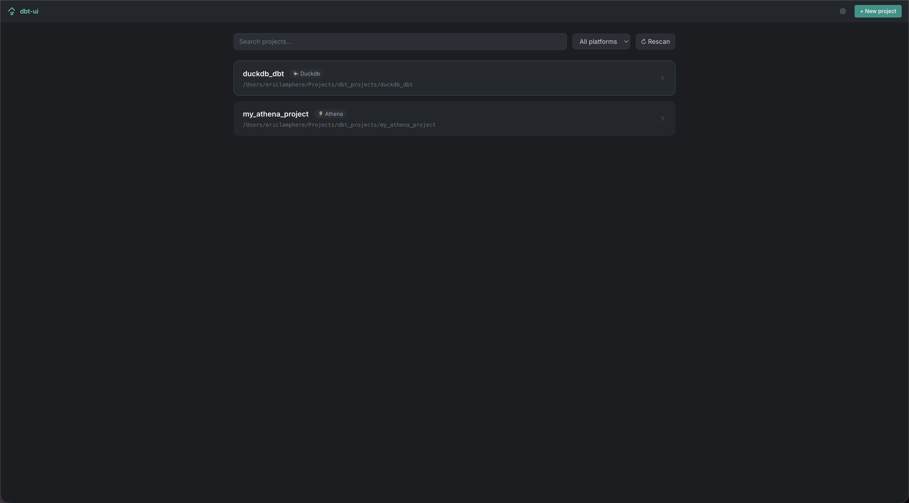
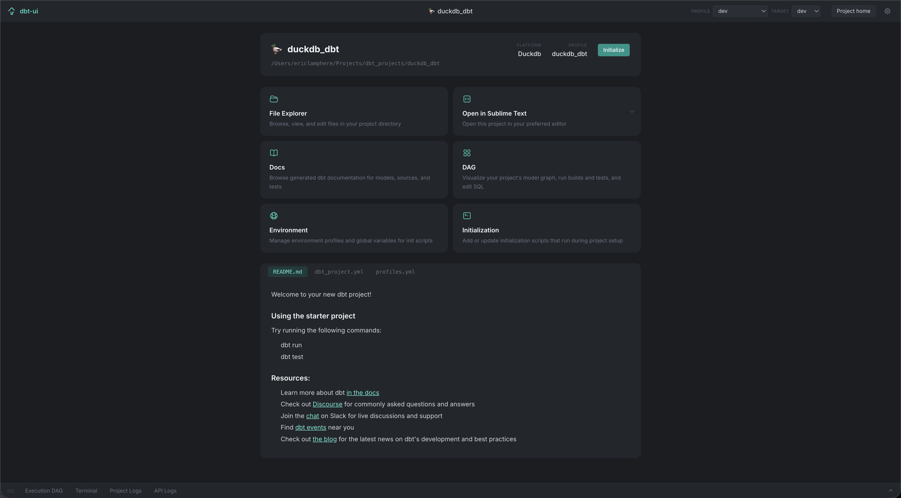
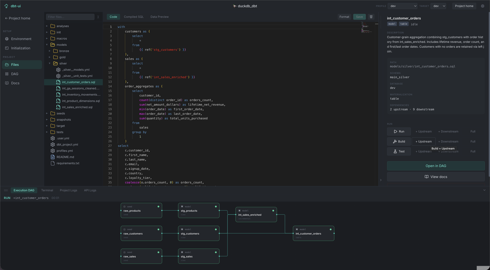
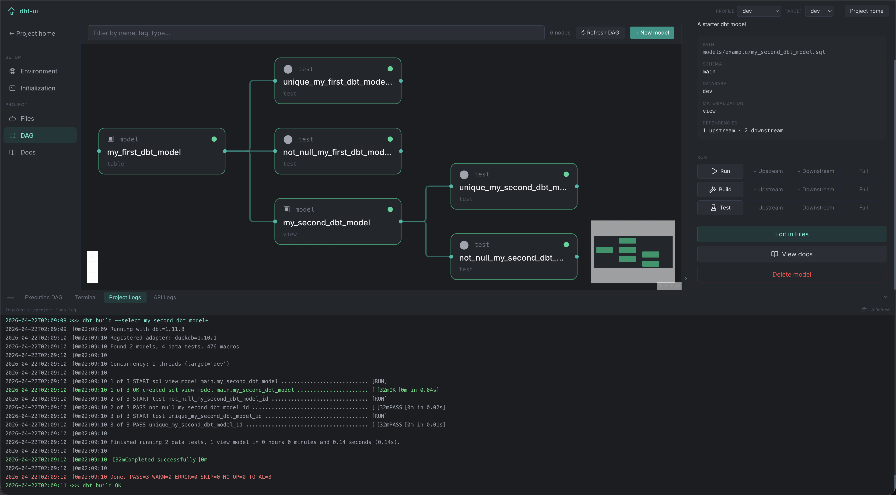
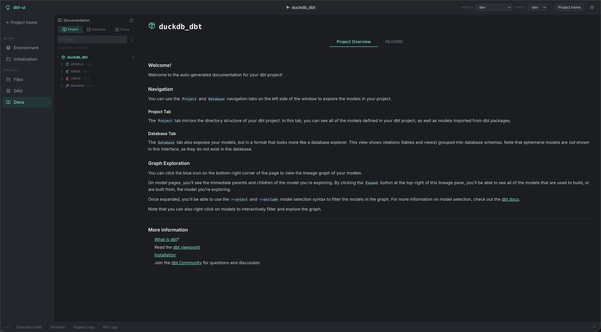
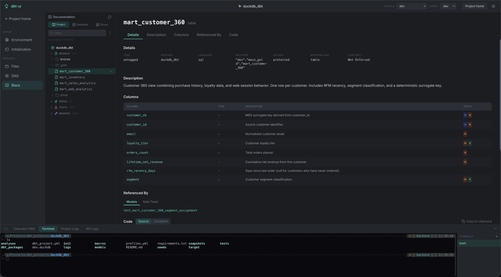
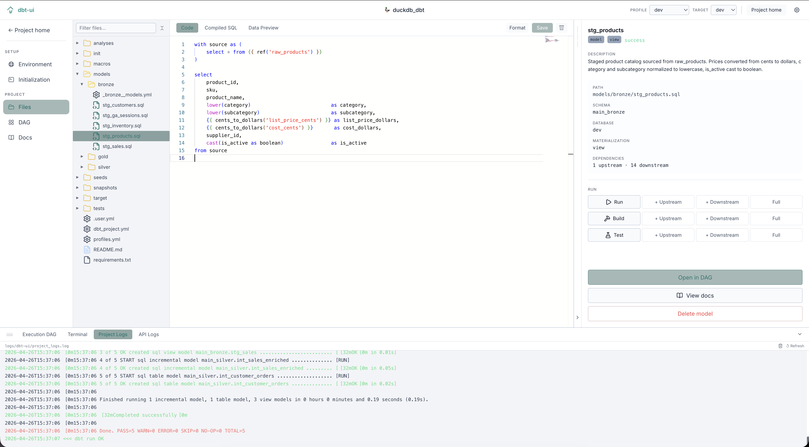

# dbt-ui

An open-source, local-first web UI for [dbt-core](https://github.com/dbt-labs/dbt-core).

Gives you an interactive dependency graph, live run/build/test controls with streaming logs, an integrated terminal, an in-browser SQL editor, and project discovery — all running locally against your dbt projects.

Built with 

## Features

- **Project discovery** — scans a directory for `dbt_project.yml` files and lists all projects; rescan on demand
- **Interactive functional DAG** — dependency graph with live status badges, dbt-style selector syntax (`+model`, `tag:x`), upstream/downstream traversal, and real-time status updates while models run. Multi-select nodes to run, build, and test multiple models at once
- **Run / build / test** — trigger any dbt command from the side panel with upstream/downstream/full selector support; logs stream live
- **Docs browser** — native dbt docs viewer with searchable column list and cross-navigation to the DAG and file editor
- **File explorer & SQL editor** — browse your project tree and edit model SQL, YAML, and config files in-browser with Monaco (the VS Code editor engine)
- **Integrated terminal** — multi-tab bash/zsh terminal in the bottom pane for running dbt commands directly
- **Init pipeline** — configurable initialization steps (`pip install`, `dbt deps`, custom shell scripts) that run automatically when a project is opened; env vars exported from scripts are captured and injected into all dbt invocations
- **Environment profiles** — define named env var sets globally and apply them per-project; switch profiles and dbt targets from the header
- **Interactive project creation** — `dbt init` runs in a full in-browser terminal; adapter install, profiles.yml setup, and project discovery all handled automatically
- **Column-level lineage** — click any column in the DAG to trace its data flow upstream and downstream across models; edges highlight the exact columns that feed into each transformation
- **Source control (Git)** — VSCode-style source control panel: view changed files, stage/unstage, Monaco diff viewer, commit, push/pull with live streaming output, branch switch/create, and commit history
- **SQL Workspace** — standalone SQL scratchpad with a file tree, Monaco editor, Compiled SQL tab (via `dbt compile --inline`), and a resizable results pane (via `dbt show --inline`); files are saved under a configurable `workspace/` folder inside the project; Cmd+Enter runs, Cmd+S saves
- **Autocomplete** - Autocomplete on refs, sources, and documented columns to make writing and running jinja SQL easier than ever
- **Health check** — run `dbt debug` from the UI and see a structured pass/fail table per check (connection, profiles.yml, project.yml, etc.) with version info and raw log
- **Schema drift** — scan all materialized models and compare warehouse column schemas against `manifest.json` declarations; shows per-model diffs (added/removed/type-mismatch columns)
- **Column profiling** — run a column profile on any model from the SidePane to see row count, null%, distinct count, min/max, and sample values per column

## Stack highlights
- Backend: FastAPI, SQLAlchemy (async), aiosqlite, sse-starlette, watchfiles, ptyprocess
- Frontend: React 18, Vite, TypeScript, @xyflow/react, dagre, Monaco, xterm.js, TanStack Query, Tailwind CSS
- DB: SQLite (11 tables)
- dbt invocation: subprocess only via `backend/.venv/bin/dbt` (serialized per project via asyncio.Lock)

## Quickstart

### Prerequisites

- Python 3.11+
- Node.js 20+
- [Task](https://taskfile.dev) (`brew install go-task`)

### 1. Install dependencies

```bash
task install
# or pin a specific Python version:
task install PYTHON=python3.12
```

### 2. Start

```bash
task start       # foreground — logs stream to terminal
task start:bg    # headless — daemonizes both servers, opens browser automatically
```

Open [http://localhost:5173](http://localhost:5173).

To stop a headless session:

```bash
task stop
```

### 3. Configure your projects path

On first launch, a banner prompts you to set **DBT_UI_PROJECTS_PATH** — the directory containing your dbt projects. Click **Configure** and enter the path. The project list loads once the path is set.

You can also set it via environment variable instead of the UI:

```bash
export DBT_UI_PROJECTS_PATH=$HOME/dbt-projects
task start
```


## Environment Variables

| Variable | Default | Description |
|---|---|---|
| `DBT_UI_PROJECTS_PATH` | _(none)_ | Root directory scanned for dbt projects (overridable via UI) |
| `DBT_UI_GLOBAL_REQUIREMENTS_PATH` | _(none)_ | Path to a `requirements.txt` installed into the dbt venv on every project open |
| `DBT_UI_DATA_DIR` | `data/` | SQLite storage directory |
| `DBT_UI_LOG_LEVEL` | `INFO` | `DEBUG`, `INFO`, `WARNING`, `ERROR` |

Per-project settings (stored in `project_env_vars`, injected into every dbt subprocess):

| Key | Set by | Description | Default |
|---|---|---|---|
| `INIT_SCRIPT_PATH` | Environment tab | Directory (relative to project root) scanned for `.sh` init scripts | `init` |
| `REQUIREMENTS_PATH` | Environment tab | Path to a project-specific `requirements.txt`; installed in addition to the global one | _(none)_ |
| `WORKSPACE_PATH` | Environment tab | Directory (relative to project root) where SQL Workspace files are stored | `workspace` |
| `dbt_target` | Target dropdown | Active dbt target; passed as `--target` on every invocation | _(profiles.yml default)_ |
| _(any key)_ | Init scripts (automatic) | Any `export KEY=value` in a custom init script is captured and stored here automatically | — |


## Gallery

#### Homepage


#### Project Homepage


#### File Explorer


#### DAG


#### Docs




#### Light Theme



## License

MIT
