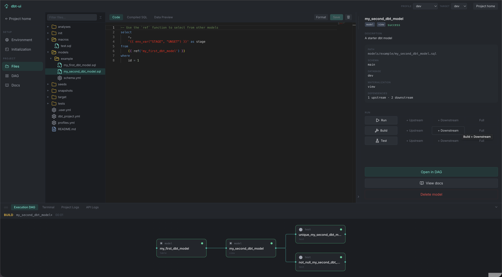
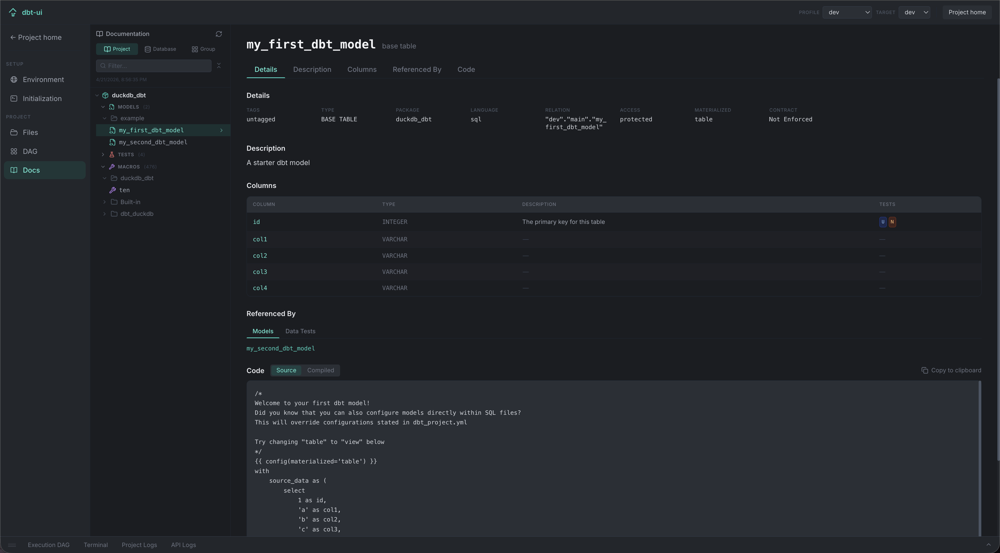

# dbt-ui

An open-source, local-first web UI for [dbt-core](https://github.com/dbt-labs/dbt-core).

Gives you an interactive dependency graph, live run/build/test controls with streaming logs, an integrated terminal, an in-browser SQL editor, and project discovery — all running locally against your dbt projects.

## Features

- **Project discovery** — scans a configured directory for `dbt_project.yml` files and lists all projects
- **Interactive DAG** — React Flow graph of all models and their lineage with live status badges; models turn blue in real time while running
- **Run / build / test** — trigger dbt commands from any model tile with upstream / downstream / full selector support; logs stream live in the bottom pane
- **Execution DAG** — bottom pane shows only the models that ran, with real-time running/success/error status
- **Side panel** — collapsible right-side panel on both the DAG and File Explorer pages; shows model metadata, run controls, and action buttons in a single unified view
- **Profile & target selectors** — header dropdowns to switch environment profiles and dbt targets on any project page; target is passed as `--target` on every dbt invocation
- **Project homepage files** — README, `dbt_project.yml`, and `profiles.yml` rendered in a tabbed Monaco viewer on the project homepage
- **Integrated terminal** — VSCode-style multi-tab terminal in the bottom pane (bash/zsh)
- **SQL editor** — view and edit model SQL in-browser with Monaco (VS Code engine); saves to disk
- **Live updates** — file watcher resets stale model tiles within ~200ms of a file change; manifest/run_results parsed on the fly
- **Init pipeline** — configurable, sortable initialization steps (`dbt deps` + custom shell scripts) shown in a step-status modal
- **Interactive `dbt init`** — create new projects in a full xterm.js terminal modal; writes `profiles.yml` into the new project directory automatically
- **Project-local profiles** — `profiles.yml` co-located in the project directory; dbt invocations use `--profiles-dir` automatically when the file is present
- **Global settings** — configure your dbt projects path from within the UI

## Quickstart

### Prerequisites

- Python 3.11+
- Node.js 20+
- [Task](https://taskfile.dev) (`brew install go-task`)
- `dbt-core` installed and on your `$PATH`

### 1. Install dependencies

```bash
task install
```

### 2. Start

```bash
task start
```

Open [http://localhost:5173](http://localhost:5173).

### 3. Configure your projects path

On first launch, a banner prompts you to set **DBT_PROJECTS_PATH** — the directory containing your dbt projects. Click **Configure** and enter the path. The project list loads once the path is set.

You can also set it via environment variable instead of the UI:

```bash
export DBT_PROJECTS_PATH=$HOME/dbt-projects
task start
```

## Development

### Run dev servers

```bash
task start          # backend + frontend in parallel
```

Or run separately:

```bash
task dev:backend    # FastAPI with hot reload (:8001)
task dev:frontend   # Vite dev server, proxies /api → :8001 (:5173)
```

### Tests

```bash
task test           # backend pytest + frontend tsc check
task test:backend   # pytest with coverage report
```

### Lint

```bash
task lint
```

### Reset database

```bash
task db:reset
```

## Architecture

```
dbt-ui/
├── backend/          FastAPI, SQLAlchemy/aiosqlite, watchfiles, sse-starlette, ptyprocess
│   └── app/
│       ├── api/      REST endpoints + SSE (projects, models, runs, init, terminal, settings, …)
│       ├── db/       SQLAlchemy models (8 tables) + startup migrations
│       ├── dbt/      manifest parser, run_results, subprocess runner, init scripts, PTY manager
│       ├── events/   in-process pub/sub EventBus, SSE helpers
│       ├── projects/ discovery + service (_effective_workspace)
│       └── watcher/  watchfiles per-project task
├── frontend/         React + Vite + TypeScript
│   └── src/
│       ├── routes/   Home, Project/index, Models, Docs, FileExplorer, Environment, InitScripts
│       ├── components/ Header, StatusBadge, shared UI
│       └── lib/      api.ts, sse.ts (useProjectEvents, useInitSessionEvents, useTerminalEvents)
├── docs/
│   └── architecture.md
├── data/             SQLite database (git-ignored)
└── Taskfile.yml
```

**Stack highlights:**
- Backend: FastAPI, SQLAlchemy (async), aiosqlite, sse-starlette, watchfiles, ptyprocess
- Frontend: React 18, Vite, TypeScript, @xyflow/react, dagre, Monaco, xterm.js, TanStack Query, Tailwind CSS
- DB: SQLite (8 tables)
- dbt invocation: subprocess only (serialized per project via asyncio.Lock)

## Environment Variables

| Variable | Default | Description |
|---|---|---|
| `DBT_PROJECTS_PATH` | _(none)_ | Root directory scanned for dbt projects (overridable via UI) |
| `DBT_UI_DATA_DIR` | `data/` | SQLite storage directory |
| `DBT_UI_LOG_LEVEL` | `INFO` | `DEBUG`, `INFO`, `WARNING`, `ERROR` |


## Gallery

#### Homepage


#### Project Homepage


#### File Explorer


#### DAG


#### Docs





## License

MIT
