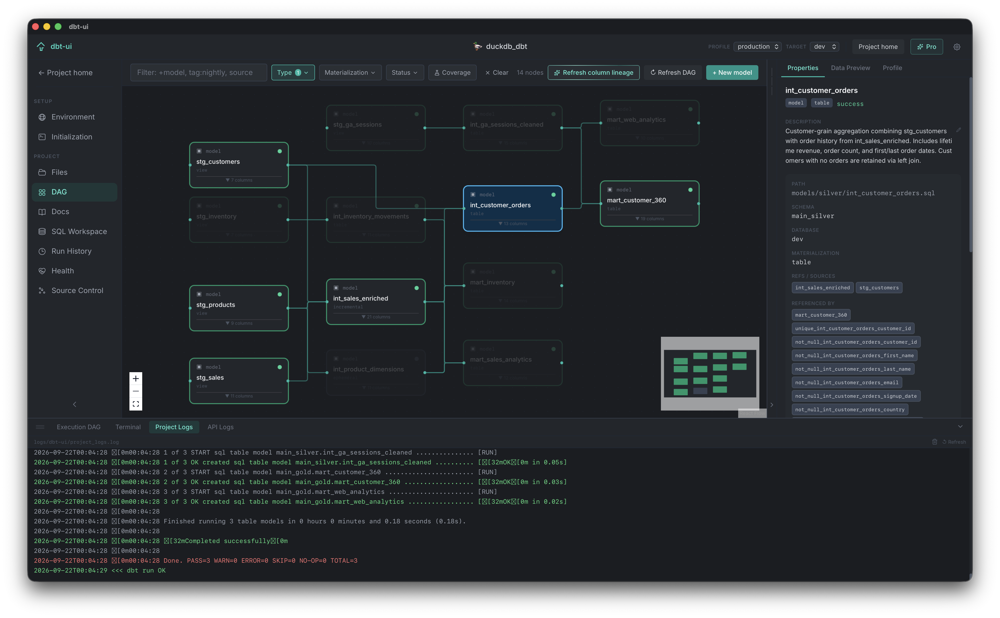

# dbt-ui

A local-first desktop app for [dbt-core](https://github.com/dbt-labs/dbt-core): an interactive dependency graph, live run/build/test with streaming logs, an in-app SQL editor, and Git, all running against your own dbt projects. No cloud account, and no data leaves your machine.



## Getting Started

**[Download dbt-ui from lampherelabs.com](https://lampherelabs.com/tools/dbt-ui)**

1. Download the `.dmg` for macOS (Apple Silicon).
2. Open it and drag **dbt-ui** into **Applications**.
3. Launch dbt-ui and point it at the folder that holds your dbt projects.

The app is signed and notarized by Apple, so it opens like any other Mac app. You'll need `git` on your `PATH`. dbt itself is installed for you: on first launch a setup wizard asks where your projects live and which Python to use, then installs dbt into an isolated environment.

dbt-ui is free and open source. [dbt-ui Pro](https://lampherelabs.com/tools/dbt-ui#pricing) is an optional subscription that adds advanced features and supports continued development. You can upgrade from **Upgrade to Pro** in the app's header.

Don't feel like downloading the app or paying for pro? Run it for free in your browser instead:
```sh
task start
```

## Features

- **Interactive DAG** — dependency graph with live status badges, dbt selector syntax (`+model`, `tag:x`), upstream/downstream traversal, and real-time updates while models run. Multi-select nodes to run, build, or test a whole slice at once
- **Run / build / test** — trigger any dbt command from the side panel with upstream/downstream/full selectors; logs stream live
- **SQL Workspace** — a scratchpad with the Monaco editor (the engine behind VS Code), a Compiled SQL tab, and a resizable results pane. Cmd+Enter runs, Cmd+S saves
- **File explorer & editor** — browse and edit model SQL, YAML, and config with autocomplete on refs, sources, and documented columns
- **Source control** — a VS Code-style Git panel: stage, diff, commit, push/pull, switch branches, and browse history
- **Docs browser** — native dbt docs with searchable columns, cross-linked to the DAG and editor; macros include a live "Try It" compiler
- **Health checks** — `dbt debug` as a structured pass/fail table, schema drift between your warehouse and `manifest.json`, and source freshness
- **Documentation generator** — one click adds a model (or seed/snapshot) and its warehouse columns to the schema YAML in its folder, creating the file if needed; also from Schema Drift for warehouse-only columns. Existing YAML is left untouched apart from the added lines
- **Impact analysis** — select a model to see everything downstream of it, grouped by depth, with test counts, column coverage, and risk flags (untested models, exposures, incremental models, failing or stale nodes); build the whole impacted slice or copy its selector in one click. Also works on your git changes: see what your uncommitted work, or your whole branch vs. `main`, affects before you commit or open a PR, including models changed indirectly through an edited macro
- **Column profiling & test coverage** — row counts, null %, distinct counts, min/max, and samples per column; an optional DAG overlay shows per-column test coverage
- **Run history** — every dbt invocation with duration and per-node results, plus per-node trends across recent runs
- **Environment control** — named env var profiles, dbt target switching, and an init pipeline (`pip install`, `dbt deps`, your own scripts) that runs when a project opens
- **Integrated terminal & project creation** — multi-tab terminal in the bottom pane; `dbt init` runs in an in-app terminal with adapter install and `profiles.yml` setup handled for you
- **Command palette** — ⌘K to jump to any page, project, or model, or run a dbt command
- **Back / forward navigation** — header arrows (or ⌘[ / ⌘] or ⌘← / ⌘→ and mouse side buttons) step through your last 25 pages, in-page tabs, opened files, and selected DAG/docs nodes
- **Arbitrary dbt commands** — type any `dbt …` command (from ⌘K or the project homepage) and it runs with your active profile and target, streams to the Run panel, and lands in run history
- **Column-level lineage** (Pro) — click any column in the DAG to trace where its data comes from and where it goes, derived from each model's compiled SQL
- **Column-level impact** (Pro) — in the Impact tab, pick the columns you're changing to see only the downstream columns, models and tests they reach, including models that filter, join or group on them (which changes every row)

## Developing dbt-ui

You'll need Python 3.11+, Node.js 20+, and [Task](https://taskfile.dev) (`brew install go-task`).

```bash
task install    # set up the Python venv and npm packages
task start      # run the app in your browser at http://localhost:5173
```

`task start` runs the backend and frontend dev servers with hot reload, installing (or updating) Python and npm dependencies first if needed — so on a fresh clone or after a `git pull`, it works on its own. It's the fastest way to work on dbt-ui.

To test your changes in the desktop app itself:

```bash
task package:app   # build the desktop app (free features only) and install it to /Applications
```

See [CONTRIBUTING.md](CONTRIBUTING.md) for tests, configuration, architecture, and packaging details.

Built with 

## License

MIT
